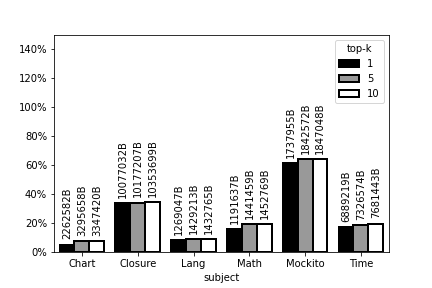

# 实验说明 草稿6


## 表 defects4j  项目信息 [100%]

| subject | versions | LoC   | Functions | Predicates | Tests | Language |
| ------- | -------- | ----- | --------- | ---------- | ----- | -------- |
|space|34|6,199|136|25,449|1,248|C|
|sed|4|14,427|112|101,233|363|C|
|gzip|13|5,680|91|179,962|213|C|
|grep|5|10,068|129|228,498|809|C|
|bash|6|59,846|1,458|928,566|300|C|
|nanoxml|22|7,646|552|5,128|236|Java|
|siena|3|6,035|249|19,130|567|Java|
|ant|4|80,500|8,863|203,576|149|Java|
|derby|3|503,833|28,887|1,389,976|258|Java|
| Chart   | 26       | 85074 | 7489      | 558336     | 1815  | Java     |
| Closure | 176      | 83721 | 9467      | 199186     | 3460  | Java     |
| Lang    | 65       | 18487 | 2220      | 84378      | 1823  | Java     |
| Math    | 106      | 50651 | 4819      | 845426     | 216   | Java     |
| Mockito | 38       | 8901  | 1317      | 9218       | 1141  | Java     |
| Time    | 27       | 27259 | 3881      | 93138      | 3917  | Java     |

注明，Math 因为时间关系仅计算 bug 相关的测试（相关由defects4j定义），各项结果求平均。


## 实验1 defects4j 结果 [90%]

### 谓词 [100%]


### 运行 [100%]

时间


空间


### 预处理 [80%]

时间 

空间

### 挖掘 [60%]

时间

空间


## 实验2 defects4j 结果 [100%]

### RQ1 [100%]

表

| subject  | top 1 | top 5 | top 10 |
| ------- | ----- | ----- | ------ |
| Lang    | 1.06  | 1.13  | 1.13   |
| Chart   | 0.59  | 0.74  | 0.77   |
| Math    | 1.20  | 1.31  | 1.31   |
| Time    | 5.92  | 7.47  | 7.50   |
| Mockito | 13.70 | 14.34 | 14.56  |
| Closure | 7.69  | 8.17  | 8.35   |

图


### RQ 2 [100%]


branch

| subject  | branch_iter | branch_perd |
| ------- | -------------------- | -------------------- |
| Lang    | 6.60                 | 0.98                 |
| Chart   | 45.64                | 1.75                 |
| Math    | 18.74                | 1.39                 |
| Time    | 65.22                | 8.26                 |
| Mockito | 62.89                | 18.50                |
| Closure | 341.98               | 10.58                |

return

| subject  | return_iter | return_perd |
| ------- | -------------------- | -------------------- |
| Lang    | 5.74                 | 1.33                 |
| Chart   | 24.52                | 1.18                 |
| Math    | 16.16                | 1.12                 |
| Time    | 63.65                | 4.59                 |
| Mockito | 45.57                | 14.78                |
| Closure | 282.53               | 9.43                 |


scalar

| subject  | scalar_iter | scalar_perd |
| ------- | ----------- | ----------- |
| Lang    | 4.98        | 1.31        |
| Chart   | 17.32       | 0.69        |
| Math    | 17.74       | 1.37        |
| Time    | 42.70       | 8.44        |
| Mockito | 23.54       | 13.23       |
| Closure | 127.45      | 7.34        |


### RQ 3 [100%]

| 行标签 | 平均值项:outputs | 平均值项:s1 | 平均值项:s100 | 平均值项:s10000 | 平均值项:cg | 平均值项:iterative |
| ------ | ----------------- | ------------ | -------------- | ---------------- | ------------ | ------------------- |
| Lang     | 1.00              | 130.12       | 7.78           | 5.58             | 4.69         | 1.44                |
| Chart     | 1.00              | 184.05       | 19.84          | 16.55            | 27.99        | 1.19                |
| Math    | 1.00              | 756.20       | 79.47          | 33.39            | 30.33        | 11.03               |
| Time     | 1.00              | 140.21       | 15.08          | 11.23            | 28.48        | 1.28                |
| Mockito     | 1.00              | 5.80         | 5.48           | 5.37             | 8.65         | 1.23                |
| Closure     | 1.00              | 5.66         | 3.64           | 3.41             | 7.69         | 1.19                |

说明：对原始数据先算比例，然后取平均。

## defects4j  实验环境 [82%]

系统

- sample-cc 需要 Fedora 19/20 64-bit (x86_64)

- mbs 需要 boost-options 1.46.1 包含于 debian 系如 ubuntu 12.04

想完全自动化实验流程，目前不少步骤需要手工操作，比如不同环境之间交换文件。

每步操作保留原始输出文件（汇总前的文件）。


脚本：创建实验环境

```bash
docker run -it --rm -v $PWD:$PWD -w $PWD ubuntu:12.04
# 安装依赖的库
sed -i -re 's/archive/old-releases/g' /etc/apt/sources.list
apt-get update
apt-get install -y wget openjdk-7-jre openjdk-7-jdk subversion cpanminus git build-essential patch  ruby1.9.1  unzip
apt-get install -y libboost-program-options1.46 libprotobuf-c0 libprotobuf7 antlr3 libantlr3c-dev  
# 安装defects4j
git clone https://github.com/rjust/defects4j.git
cd defects4j
git checkout v1.5.0
./init.sh
cpan install DBI DBD::CSV URI JSON JSON::Parse List::Util
#cpanm --installdeps .
```


## 原实验对象 SIR 结果

### EX1 [80%]

整理了原实验的脚本 [100%]

跑通流程 [100%]

收集数据 [50%]


### EX2RQ1 [100%]

表

| 行标签     | 平均值项:top-1 | 平均值项:top-5 | 平均值项:top-10 |
| ---------- | -------------- | -------------- | --------------- |
| apache-ant | 11.46          | 14.54          | 14.54           |
| bash       | 30.99          | 30.99          | 30.99           |
| derby      | 15.92          | 20.69          | 22.15           |
| grep       | 27.91          | 36.07          | 36.08           |
| gzip       | 32.06          | 32.20          | 35.50           |
| nanoxml    | 36.37          | 50.48          | 50.67           |
| sed        | 40.50          | 48.87          | 60.56           |
| siena      | 20.00          | 31.43          | 31.43           |
| space      | 45.30          | 49.20          | 51.98           |

图


### EX2RQ2 [100%]

branch

| name       | branch_iter | branch_perd |
| :--------- | ----------: | ----------: |
| apache-ant |      490.75 |       21.87 |
| bash       |      239.00 |       27.96 |
| derby      |     4425.33 |       41.45 |
| grep       |       40.80 |       52.55 |
| gzip       |       32.69 |       47.20 |
| nanoxml    |       49.09 |       49.23 |
| sed        |       50.75 |       67.72 |
| siena      |       29.00 |       24.22 |
| space      |       80.06 |       69.05 |

return

| name       | return_iter | return_perd |
| :--------- | ----------: | ----------: |
| apache-ant |      385.75 |       20.63 |
| bash       |      225.67 |       23.38 |
| derby      |     1890.67 |       19.66 |
| grep       |       17.60 |       39.47 |
| gzip       |       17.23 |       36.75 |
| nanoxml    |       36.18 |       51.33 |
| sed        |       40.00 |       62.84 |
| siena      |       16.00 |       14.73 |
| space      |       58.35 |       70.22 |

scalar

| name       | scalar_iter | scalar_perd |
| :--------- | ----------: | ----------: |
| apache-ant |      190.75 |       12.30 |
| bash       |      238.17 |       31.38 |
| derby      |     1436.67 |       21.43 |
| grep       |       18.60 |       36.03 |
| gzip       |       24.54 |       32.24 |
| nanoxml    |       12.95 |       61.16 |
| sed        |       37.25 |       60.49 |
| siena      |       25.00 |       35.70 |
| space      |       58.09 |       45.54 |


### EX2RQ3 [80%]

原数据取平均

| project    | outputs | s1       | s100    | s10000  | cg      | iterative |
| ---------- | ------- | -------- | ------- | ------- | ------- | --------- |
| apache-ant | 1410033 | 8541052  | 1803368 | 970198  | 1456418 | 871358*   |
| bash       | 111338  | 683*     | 623*    | 646*    | 112906  | 692*      |
| derby      | 2109886 | 12084760 | 4399369 | 3381398 | 2387106 | 0*        |
| grep       | 4367    | 51601    | 37821   | 34564   | 4979    | 1749*     |
| gzip       | 13205   | 46985    | 32844   | 30784   | 13910   | 11235     |
| nanoxml    | 43570   | 71052    | 63389   | 62486   | 97128   | 55221    |
| sed        | 2439    | 11915    | 9163    | 8601    | 2967    | 1809*     |
| space      | 7310    | 13027    | 12886   | 12353   | 8247    | 7851      |
|siena|14701|15024|18577|16242|20860|0.00*|

 原数据归一化

|project|outputs|s1|s100|s10000|cg|iterative|
| ---------- | ------- | -------- | ------- | ------- | ------- | --------- |
|apache-ant|1.00 |6.06 |1.28 |0.69 |1.03 |0.62* |
|bash|1.00 |0.01 |0.01 |0.01 |1.01 |0.01* |
|derby|1.00 |5.73 |2.09 |1.60 |1.13 |0.00* |
|grep|1.00 |11.82 |8.66 |7.92 |1.14 |0.40* |
|gzip|1.00 |3.56 |2.49 |2.33 |1.05 |0.85* |
|nanoxml|1.00 |1.63 |1.45 |1.43 |2.23 |1.27 |
|sed|1.00 |4.89 |3.76 |3.53 |1.22 |0.74* |
|space|1.00 |1.78 |1.76 |1.69 |1.13 |1.07 |
|siena|1.00|1.02	|1.26|	1.10	|1.41| 0* |


备注：

- iterative 列数据有问题，原脚本也不能复现，而且有代码改动，需要数据更新。
- bash 项目似乎有问题，这个就虚拟机里原来的脚本，好奇怪。
- 原实验是挑的部分版本跑的，没看出按照什么挑的。
- 汇总数据按照原始数据取平均值。
- 时间本身容易波动。
- 

## 两次实验汇总

### 实验2RQ1 [100%]

表

| subject | top 1 | top 5 | top 10 |
| ------- | ----- | ----- | ------ |
| Lang    | 1.06  | 1.13  | 1.13   |
| Chart   | 0.59  | 0.74  | 0.77   |
| Math    | 1.20  | 1.31  | 1.31   |
| Time    | 5.92  | 7.47  | 7.50   |
| Mockito | 13.70 | 14.34 | 14.56  |
| Closure | 7.69  | 8.17  | 8.35   |
| - |  |  |  |
| apache-ant | 11.46 | 14.54 | 14.54 |
| bash       | 30.99 | 30.99 | 30.99 |
| derby      | 15.92 | 20.69 | 22.15 |
| grep       | 27.91 | 36.07 | 36.08 |
| gzip       | 32.06 | 32.20 | 35.50 |
| nanoxml    | 36.37 | 50.48 | 50.67 |
| sed        | 40.50 | 48.87 | 60.56 |
| siena      | 20.00 | 31.43 | 31.43 |
| space      | 45.30 | 49.20 | 51.98 |

图


## 实验的算法说明

关于实验对象

- S/SIR
- defects4j 版本 1.5

关于实验算法的原理，整个实验包含两个算法.

1. 实验1 是根据选择满足失败测试用例数大于阈值的。
2. 实验2 枚举可能取值的范围，用于剪枝。

关于提升计时精度：多次运行取平均，对相同输入缓存输出。

关于项目差异：总代码规模，失败测试用例个数。

关于绘图样式：：plt.imshow(x,aspect='auto')

补充： 

- 一些版本没有谓词如 Lang 25，统计时去掉。

- 一些版本存在某条测试用例被重复执行（原项目就是这样的）
- 有些统计指标对Math、C 只算了相关测试用例。


## 实验脚本和输出文件

实验 1 输出文件


实验 2 输出文件

1. sites `./nanoxml/versions/v1/subv1/coarse-grained/output.sites`
2. profile `./nanoxml/traces/v1/subv1/coarse-grained/*.?profile`
3. time `./nanoxml/outputs.alt/v1/versions/subv1/coarse-grained/time`

脚本

- 汇总 实验2的RQ1/2 结果 HI.jar
- 汇总 RQ3 结果 `java -cp tools/HI.jar zuo.util.readfile.IterativeTimeReader "$PWD/outputs" nanoxml "$PWD/outputs/out/"`
  - 比较对象 "fine-grained-adaptive","outputs","coarse-grained","fine-grained","fine-grained-sampled-1","fine-grained-sampled-100","fine-grained-sampled-10000"
  - 其中 fine-grained-adaptive 根据 _C_LESS_FIRST_1_average 取平均

### 原实验 1 脚本

preprocess + mbs
- 输入fg，当为basline时为全插桩fg，当优化时为部分插桩boost/prune/boost-prune
- `java -jar preprocess.jar fg_profiles_folder fg_sites_file dataset_output_folder` 产生 `dataset_output_folder/mps-ds.pb` 文件
- `mbs -k $k -n 0.5 -g --refine 2 --metric 0 --dfs --merge --cache 9999 --up-limit 2 mps-ds.pb -o mbs_output_file`
- 属于bug s 算法，需要 mint 系统

himps.jar
- 输入是全插桩的列表（不含执行信息），输出是需要插桩的方法/函数
- `java -jar himps.jar cg_sites_file cg_profiles_folder fg_sites_file --boost γ boost_output_file`
- `java -jar himps.jar cg_sites_file cg_profiles_folder fg_sites_file --prune θ prune_output_file`
- γ=0.05，θ=mbs_output_file


生成脚本 HI.jar
- 输入参数 boost
- 输入参数 函数列表
  - `boost/boost_functions_2_0.05.txt`
  - `pruneMinusBoost/prune_minus_boost_functions_2_0.05.txt`
  - `prune/prune_functions_2_0.05.txt`
  - 绝对路径 `/home/sunzzq2/Data/IResearch/Automated_Bug_Isolation/Twopass_heavy/Subjects/${sub}/versions/v${pid}/subv${bid}/predicate-dataset/...`

输出 sh 文件
- sh


```bash
java -cp ../tools/HI.jar zuo.processor.genscript.client.twopass.GenBashScriptClient # bash
java -cp ../tools/HI.jar zuo.processor.genscript.client.twopass.GenSiemensScriptsClient # space replace 
java -cp ../tools/HI.jar zuo.processor.genscript.client.twopass.GenSirScriptClient #  grep gzip sed 
```

输入 
1. `"/home/sunzzq2/Data/IResearch/Automated_Bug_Isolation/Twopass_heavy/Subjects/${sub}/versions/v${pid}/subv${bid}/predicate-dataset/boost/boost_functions_2_0.05.txt"`
2. `"/home/sunzzq2/Data/IResearch/Automated_Bug_Isolation/Twopass_heavy/Subjects/" + this.subject + "/versions/" + version + "/" + subVersion + "/predicate-dataset/pruneMinusBoost/prune_minus_boost_functions_2_0.05.txt"`
3. `"/home/sunzzq2/Data/IResearch/Automated_Bug_Isolation/Twopass_heavy/Subjects/" + this.subject + "/versions/" + version + "/" + subVersion + "/predicate-dataset/prune/prune_functions_2_0.05.txt"`


数据收集


收集的内容

- baseline 方法
  1. fg 运行测试用例的时间，空间（文件大小）
  2. preprocess + mbs 的时间、空间，四项
- two-pass 方法
  1. preprocess + mbs 的时间，空间，每个2*2项，包括
    2. boost 结果用来mine，包括2*2项
    3. prune 的结果，用来 mine，mine的时间、空间两项，预处理不统计。
    4. prune-boost 的预处理两项，结果舍弃不mine。
  5. 测试用例的时间、空间（trace文件大小），包括（cg + boost + pruneminusboost 三步的求和）

收集的方法
- 测试用例时间、空间（文件大小du）
- preprocess 的时间（程序自身返回），大小（内存占用time）
- mine 的时间（程序自身返回），大小（内存占用time）

输出的格式 pid,bid,k,key,value
其他：cache 机制
运行流程：生成函数列表
其他数据：谓词数

sudo yum install docker-io

```sh
dir="/home/sunzzq2/Data/IResearch/Automated_Bug_Isolation/Twopass_heavy/Subjects/${sub}"
java -jar himps1.jar \
  "$dir/versions/v${pid}/subv${bid}/v${pid}_subv${bid}_c.sites" \
  "$dir/traces/v${pid}/subv${bid}/coarse-grained" \
  "$dir/versions/v${pid}/subv${bid}/v${pid}_subv${bid}_f.sites" \
  --boost 0.05 \
  "/home/sunzzq2/Data/IResearch/Automated_Bug_Isolation/Twopass_heavy/Subjects/${sub}/versions/v${pid}/subv${bid}/predicate-dataset/boost/boost_functions_2_0.05.txt"

```

### 原实验 2 脚本
  - runAll_inst.sh
  - runAll_overhead.sh
  - 生成脚本
  - 说明
    - 脚本中用绝对路径：`/home/paper_60/oopsla_artifacts/single/Subjects/C/bash/`

### 脚本详情


```bash
# 实验 2
java -cp ../tools/HI.jar zuo.processor.genscript.client.iterative.GenBashScriptClient
java -cp ../tools/HI.jar zuo.processor.genscript.client.iterative.GenSiemensScriptsClient
java -cp ../tools/HI.jar zuo.processor.genscript.client.iterative.GenSirScriptClient
java -cp ../tools/HI.jar zuo.processor.genscript.client.iterative.java.AntGenSirScriptClient
java -cp ../tools/HI.jar zuo.processor.genscript.client.iterative.java.DerbyGenSirScriptClient
java -cp ../tools/HI.jar zuo.processor.genscript.client.iterative.java.NanoxmlGenSirScriptClient
java -cp ../tools/HI.jar zuo.processor.genscript.client.iterative.java.SienaGenSirScriptClient

# 实验 1
java -cp ../tools/HI.jar zuo.processor.genscript.client.twopass.GenBashScriptClient
java -cp ../tools/HI.jar zuo.processor.genscript.client.twopass.GenSiemensScriptsClient # space replace 
java -cp ../tools/HI.jar zuo.processor.genscript.client.twopass.GenSirScriptClient #  grep gzip sed 
```


### 补充

- 依赖 bison zip


### 已有脚本的修改

- profile.sh 运行当个项目版本
- overhead.sh 执行 RQ 3
- HI.jar
  - 怀疑度
  - 性能优化（不影响结果）
- himps 
  - 改了名称 函数->方法
  - 改了剪枝

- 收集项目信息。
- 辅助 debug 脚本
  - 错误行信息的覆盖信息
  - 统计失败测试用例个数

## 草稿区


```bash
java -jar preprocess.jar fg_profiles_folder fg_sites_file dataset_output_folder
mbs -k k -n 0.5 -g --refine 2 --metric 0 --dfs --merge --cache 9999 --up-limit 2 mps-ds.pb -o mbs_output_file
java -jar himps.jar cg_sites_file cg_profiles_folder fg_sites_file --boost γ boost_output_file
java -jar himps.jar cg_sites_file cg_profiles_folder fg_sites_file --prune θ prune_output_file


# 实验 2
java -cp ../tools/HI.jar zuo.processor.genscript.client.iterative.GenBashScriptClient
java -cp ../tools/HI.jar zuo.processor.genscript.client.iterative.GenSiemensScriptsClient
java -cp ../tools/HI.jar zuo.processor.genscript.client.iterative.GenSirScriptClient
java -cp ../tools/HI.jar zuo.processor.genscript.client.iterative.java.AntGenSirScriptClient
java -cp ../tools/HI.jar zuo.processor.genscript.client.iterative.java.DerbyGenSirScriptClient
java -cp ../tools/HI.jar zuo.processor.genscript.client.iterative.java.NanoxmlGenSirScriptClient
java -cp ../tools/HI.jar zuo.processor.genscript.client.iterative.java.SienaGenSirScriptClient

# 实验 1
java -cp ../tools/HI.jar zuo.processor.genscript.client.twopass.GenBashScriptClient
java -cp ../tools/HI.jar zuo.processor.genscript.client.twopass.GenSiemensScriptsClient # space replace 
java -cp ../tools/HI.jar zuo.processor.genscript.client.twopass.GenSirScriptClient #  grep gzip sed 

```


``` 

public class GenBashScriptClient {
  private static final String CG_INDICES = "indices.txt";
  
  public static final String mode = "2_0.05";
  
  private static final String BOOST_FUNCTIONS = "boost_functions_2_0.05.txt";
  
  private static final String PRUNE_MINUS_BOOST_FUNCTIONS = "prune_minus_boost_functions_2_0.05.txt";
  
  private static final String PRUNE_FUNCTIONS = "prune_functions_2_0.05.txt";
  
  public static final String rootDir = "/home/sunzzq2/Data/IResearch/Automated_Bug_Isolation/Twopass_heavy/Subjects/";
  
  public static final String setEnv = "export experiment_root=/home/sunzzq2/Data/IResearch/Automated_Bug_Isolation/Twopass_heavy/Subjects/\nexport TESTS_SRC=/home/sunzzq2/Data/IResearch/Automated_Bug_Isolation/Twopass_heavy/Subjects//bash/testplans.alt/testplans.fine\n";
  
  public static final String exeFile = "/home/sunzzq2/Data/IResearch/Automated_Bug_Isolation/Twopass_heavy/Subjects//bash/source/bin/bash ";
  
  public static final String inputsDir = "/home/sunzzq2/Data/IResearch/Automated_Bug_Isolation/Twopass_heavy/Subjects//bash/testplans.alt/testplans.selected_300/";
  
  public static final String inputsMapFile = "/home/sunzzq2/Data/IResearch/Automated_Bug_Isolation/Twopass_heavy/Subjects//bash/testplans.alt/inputs.map";}

   this.boostFunctionsDir = "/home/sunzzq2/Data/IResearch/Automated_Bug_Isolation/Twopass_heavy/Subjects/" + this.subject + "/versions/" + this.version + "/" + this.subVersion + "/predicate-dataset/boost/";
    this.pruneMinusBoostFunctionsDir = "/home/sunzzq2/Data/IResearch/Automated_Bug_Isolation/Twopass_heavy/Subjects/" + this.subject + "/versions/" + this.version + "/" + this.subVersion + "/predicate-dataset/pruneMinusBoost/";
    this.pruneFunctionsDir = "/home/sunzzq2/Data/IResearch/Automated_Bug_Isolation/Twopass_heavy/Subjects/" + this.subject + "/versions/" + this.version + "/" + this.subVersion + "/predicate-dataset/prune/";
    this.scriptDir = "/home/sunzzq2/Data/IResearch/Automated_Bug_Isolation/Twopass_heavy/Subjects/" + this.subject + "/scripts/";

    "/home/sunzzq2/Data/IResearch/Automated_Bug_Isolation/Twopass_heavy/Subjects/" + this.subject + "/versions/" + this.version + "/" + this.subVersion + "/predicate-dataset/boost/boost_functions_2_0.05.txt";
  "/home/sunzzq2/Data/IResearch/Automated_Bug_Isolation/Twopass_heavy/Subjects/" + this.subject + "/versions/" + this.version + "/" + this.subVersion + "/predicate-dataset/pruneMinusBoost/prune_minus_boost_functions_2_0.05.txt";
    "/home/sunzzq2/Data/IResearch/Automated_Bug_Isolation/Twopass_heavy/Subjects/" + this.subject + "/versions/" + this.version + "/" + this.subVersion + "/predicate-dataset/prune/prune_functions_2_0.05.txt";
 
      this.vboostoutputDir = "/home/sunzzq2/Data/IResearch/Automated_Bug_Isolation/Twopass_heavy/Subjects/" + this.subject + "/outputs.alt/" + this.version + "/versions/" + this.subVersion + "/boost/";
```


```bash
dir=/home/paper_60/oopsla_artifacts/single/Subjects/C/bash
java -jar preprocess.jar\
  "/home/dell/data1/zuo/paper_60/oopsla_artifacts/single/Subjects/C/bash/traces/v1/subv1/fine-grained/"\
  "/home/dell/data1/zuo/paper_60/oopsla_artifacts/single/Subjects/C/bash/versions/v1/subv1/v1_subv1_f.sites"\
  dataset_output_folder
mbs -k k -n 0.5 -g --refine 2 --metric 0 --dfs --merge --cache 9999 --up-limit 2 mps-ds.pb -o mbs_output_file
java -jar himps.jar cg_sites_file_cg_profiles_folder fg_sites_file --boost γ boost_output_file
java -jar himps.jar cg_sites_file_cg_profiles_folder fg_sites_file --prune θ prune_output_file
```


TODO

失败测试用例数


 

依赖 bison zip

adaptive 文件夹

输出traces的文件夹。


运行 bash 

`find . -name 'fg_a.sh' -exec bash {} \;` 

comp.out


    public static String getUniqueFunctionName(final String function, final String file) {
    	if(!file.contains("/")){
    		return function + "->" + file;
    	}
        return String.valueOf(function) + "->" + file.substring(file.lastIndexOf(47, file.lastIndexOf(47, file.lastIndexOf(47) - 1) - 1));
    }