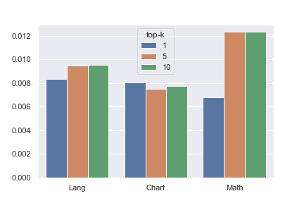
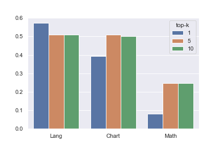
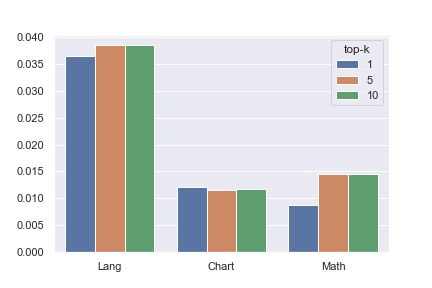
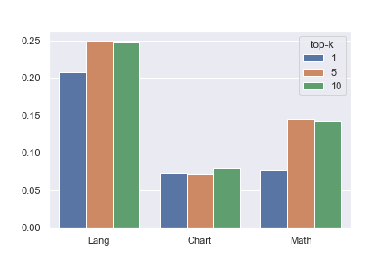
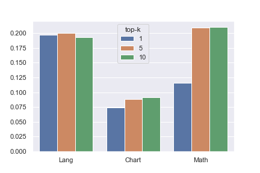
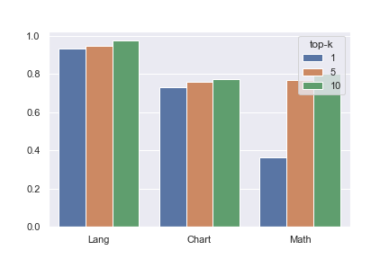
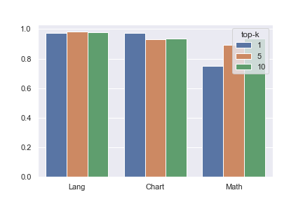
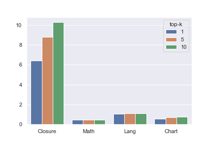

# 实验结果

## 说明

目前整体来说，运行时间还是相当不可控。虽然性能优化不影响结果，但是无法及时看到执行的结果，给实验造成极大的困惑。整个实验的难点就是原有执行流程根本无法直接在大规模的程序时间上可行。

目前运行中耗时的地方如下，是否需要优化需要看情况。
- 插桩时间
  - [ ] 目前的插桩步骤先解析字节码，统计插桩个数，输出中间代码（这步可以删掉）。然后再重新解析字节码，然后做代码变换。这里解析了两次，合并后能少一次。
  - [ ] 代码变换的结果转换为字节码，再写入硬盘并执行。这步是否可以直接内存中运行修改后的结果。
- 测试用例执行的时间
  - [ ] Math 这样的库极其慢而且有100多版本，别的库也不快。
  - [X] 执行多个测试用例不要反复重启 JVM，利用JUnit框架实现。
  - [X] 目前只执行了涉及到的类的测试用例。 
- 分析数据的时间
  - [ ] 目前代码中从插桩记录中挑选每个函数的测试用例的 trace 中，用了两层循环+hash表，即对每个要分析的函数，都可能有 1000 个测试用例 10000 个插桩点，就要循环 1_000*10_000 次，是耗时的瓶颈。考虑到同函数的插桩点是连续的，可以通过下标偏移来提取数组片段。
  - [X] 分析过程中有大量怀疑度为 0 的，当降序列表确定有0时，可以跳过后面的计算。
  - [X] 怀疑度公式计算。这个不大影响时间。
- 其他
  - [X] 缓存输出结果，避免重复计算。
  - [X] 从数据集导出数据的时间，以及数据集执行测试用例会重编译代码（这步删掉）
  - [ ] 多进程运行。不能有共享状态，且需要控制CPU/RAM/DISK的占用和可能的影响。

关于结果
- 每个故障版本不具有相关性，且为了控制运行时间，只运行了版本相关的测试用例。所以代码行数和执行时间在版本之间都相差很大。因为不相干测试未运行，所以执行了的测试的代码覆盖率只是一部分。未执行部分怀疑度为 0，所以可以不影响结果。
- 原实验是以baseline作为分母，实验结果是百分比。不这样做结果的绝对数值在不同版本上差异太大。
- 这里仍然是部分结果。

## 实验结果图表

先对照一下从原实验数据 -- 数据来源 -> 图表（数据、趋势）

然后新实验数据 -> 图表

原始数据是按照不同被测项目单独生成的，并包含各自所有的子版本。

数据集描述

- Table 2. Characteristics of the chosen subject programs.
  Subject Faulty versions LoC Functions Predicates Tests Language
  - 每个被测项目信息，单位都是 个，包括 LoC Functions Predicates Tests
  - 实验2的统计数据里有一些汇总数据 methods	sites	predicates 。
  - LoC Tests

| Subject | versions | LoC   | Functions | Predicates | Tests | Language |
| ------- | -------- | ----- | --------- | ---------- | ----- | -------- |
| Lang    | 1        | 21783 | 2551      | 21681      | 174   | Java     |
| Lang    | 2        | 21752 | 2548      | 21718      | 15    | Java     |
| Lang    | 3        | 21717 | 2544      | 21693      | 173   | Java     |
| Lang    | 4        | 21689 | 2541      | 21698      | 138   | Java     |
| Lang    | 5        | 21553 | 2530      | 21573      | 14    | Java     |
| Lang    | 6        | 21485 | 2519      | 21517      | 143   | Java     |
| Lang    | 7        | 21499 | 2518      | 21553      | 167   | Java     |
| Lang    | 8        | 20367 | 2452      | 17468      | 155   | Java     |
| Lang    | 9        | 20437 | 2458      | 17522      | 166   | Java     |
| Lang    | 10       | 20446 | 2458      | 17530      | 164   | Java     |
| Lang    | 11       | 20346 | 2437      | 17437      | 12    | Java     |
| Lang    | 12       | 20339 | 2437      | 17429      | 11    | Java     |
| Lang    | 13       | 20228 | 2447      | 17444      | 209   | Java     |
| Lang    | 14       | 19634 | 2372      | 17191      | 835   | Java     |
| Lang    | 15       | 19515 | 2350      | 17159      | 11    | Java     |

实验 1

具体步骤和收集到数据项（原始格式）见前一篇论文，记录的原始数据格式是运行日志。

运行过程分3趟（1 function 2 boost 3 prune），每趟分4步（1插桩2运行3preprocess4mine）。对3趟汇总。

这里的四项数据都是用柱状图，其中数据包括插桩个数，运行时间，占用磁盘或内存。

top-k，k分别取

图表

- Fig. 6. Percentage of predicates instrumented compared with 100% fully instrumentation in MPS [57]
  - 数据来源：插桩数
  - x 轴项目名
  - y 轴百分比
  - 分组 top-k，k取1，5，10
  - chart类型 柱状图

- Fig. 7. Percentage of execution time and disk space used for profile collection compared with MPS [ 57 ] (100% as the baseline). (a) execution time, and (b) disk space.
  - 数据来源：profile collection 步骤
  - x 轴项目名
  - y 轴百分比
  - 分组 top-k
  - chart类型柱状图

- Fig. 8. Percentage of time and memory consumption for preprocessing compared with the baseline (100%) in MPS [57]. (a) time, and (b) memory consumption.
  - preprocessing 过程 
  - 数据是的几个步骤的汇总（相加）
  - x轴 y轴 分组 

- Fig. 9. Percentage of time and memory consumption for mining compared with the baseline (100%) in
  MPS [57]. (a) time, and (b) memory consumption
  - mining 过程
  - 数据是的几个步骤的汇总（相加）
  - x轴 y轴 分组 

实验 2

- Fig. 11. Percentage of predicates instrumented.
  - 数据来源：实验2RQ1
    - 列 版本名称
    - AR 列 LESS_FIRST/Top 1/ap%
    - BX列 LESS_FIRST/Top 5/ap%
    - CN列 LESS_FIRST/Top 10/ap%
  - x 轴项目名
  - y 轴百分比
  - 分组 top-k, k=1,5,10
  - chart 类型 柱状图

  
  
- Table 3. Average numbers of iterations needed for each type of predicate to find the top 5 predicates, as well as average percentages of predicates instrumented during the process.
  - 数据来源：实验2RQ2
  - index 列：项目名，子项目求平均
  - 数据列：Branch Return Scalar-pair
    - Iter Pred(%)
  - 图表类型：表格
  - 这个实验原始数据格式**同** RQ 1，
    - 每个项目分在另外三个excel文件，
    - 只取 TOP-5。
    - iter 取 BS 列 LESS_FIRST/Top 5/bi
    - Pred 取 BX列 LESS_FIRST/Top 5/ap%
    
  

| name      | branch_iter | branch_perd | scalar_iter | scalar_perd | return_iter | return_perd |
| --------- | ----------- | ----------- | ----------- | ----------- | ----------- | ----------- |
| v1_subv1  | 3           | 1.23        | 2           | 1.09        | 2           | 1.73        |
| v1_subv2  | 1           | 0.5         |             |             | 2           | 0.82        |
| v1_subv3  | 4           | 1.29        | 3           | 1.03        | 3           | 1.84        |
| v1_subv4  | 2           | 0.18        | 2           | 0.34        | 2           | 0.14        |
| v1_subv5  | 1           | 0.33        |             |             | 2           | 0.59        |
| v1_subv6  | 8           | 0.61        | 6           | 0.57        | 5           | 0.64        |
| v1_subv7  | 17          | 2.36        | 7           | 2.99        | 15          | 4.76        |
| v1_subv8  | 24          | 2.13        | 17          | 1.06        | 21          | 3.19        |
| v1_subv9  | 12          | 1.48        | 8           | 0.68        | 13          | 2           |
| v1_subv10 | 19          | 1.91        | 15          | 1.2         | 21          | 2.69        |
| v1_subv11 | 1           | 0.67        | 1           | 0.63        |             |             |
| v1_subv12 | 2           | 0.62        | 2           | 0.6         | 1           | 0.3         |
| v1_subv15 | 31          | 5.2         | 20          | 5.99        | 29          | 7.5         |
| v1_subv17 | 4           | 0.34        | 4           | 0.69        | 4           | 0.54        |

- Fig. 12. Top Importance value comparisons for program space between ARBI and two state-of-art ABI
  approaches. The forward analysis uses T-Test as the heuristic and the backward analysis uses Importance as the heuristic.
  - 数据来源：实验2 RQ 4 space_correlation.xlsx
    - sheet 3 最后两列 percentage	max_importance 是 ARBI 的数据
    - percentage 是对 Predicates 累积求和然后归一化，
    - max_importance 是 F 列到当前行的最大值
    - 两外两组对比数据有其他参考源。
  - x 轴 Percentage of predicates instrumented
  - y 轴 Top score of instrumented predicates
  - 分组 ARBI / ABI + Forward TTest / ABI + Backward Importance
  - chart 类型 折线图
  

| name      | outputs | s1    | s100  | s10000 | cg    | iterative |
| --------- | ------- | ----- | ----- | ------ | ----- | --------- |
| v1_subv2  | 2431    | 2687  | 2671  | 2656   | 2687  | 2631      |
| v1_subv3  | 2488    | 4351  | 4302  | 4250   | 3558  | 3409      |
| v1_subv4  | 2612    | 9083  | 5102  | 4511   | 3744  | 4396      |
| v1_subv5  | 2449    | 2649  | 2637  | 2602   | 2586  | 2576      |
| v1_subv6  | 2586    | 8868  | 5021  | 4729   | 3754  | 3662      |
| v1_subv7  | 2512    | 4197  | 4195  | 4179   | 3435  | 3355      |
| v1_subv8  | 2650    | 44273 | 10961 | 10450  | 9009  | 6627      |
| v1_subv9  | 2604    | 44445 | 10987 | 10387  | 9201  | 6579      |
| v1_subv10 | 2600    | 41482 | 11355 | 10470  | 9337  | 6653      |
| v1_subv11 | 2431    | 2636  | 2558  | 2593   | 2586  | 2590      |
| v1_subv12 | 2412    | 2608  | 2535  | 2577   | 2524  | 2541      |
| v1_subv13 | 2437    | 7286  | 6095  | 5900   | 5057  | 4813      |
| v1_subv14 | 2426    | 24297 | 16924 | 16192  | 13483 | 12762     |
| v1_subv15 | 2464    | 2758  | 2650  | 2641   | 2517  | 2530      |
| v1_subv16 | 2437    | 4021  | 3949  | 4029   | 3421  | 3374      |
| v1_subv17 | 2384    | 8169  | 3794  | 3680   | 3059  | 3684      |
| v1_subv18 | 2390    | 8171  | 4587  | 4414   | 3940  | 3689      |
| v1_subv19 | 2402    | 7587  | 3526  | 3510   | 2939  | 3336      |
| v1_subv20 | 2412    | 22414 | 14382 | 14236  | 11912 | 11318     |
| v1_subv21 | 2414    | 3974  | 3715  | 3724   | 3302  | 3224      |
| v1_subv22 | 2425    | 64469 | 7313  | 3346   | 2648  | 3803      |

- Table 4. User-side slowdown in times (×).
  - 数据来源：实验2 RQ 3 space_overhead.xlsx
    - 单位是运行时间，换算成**倍数**以第一列（）为分母
  - index 列 项目及版本
  - 数据列 CBI 1/1 1/100 1/10000 ARBI Phase 1 Phase 2
    - ARBI = cg + iter 这里 cg 按函数插桩 是 iter 是
  - 图表类型：表格
  
- Table 5. Data transferred over the network for CBI under the 1/100 sampling rate and ARBI; Reduction
  reports ARBI’s reduction in the total data size (i.e., Trace + Binary)
  - 数据来源：实验2 RQ 5
  - 这里跳过这个实验。